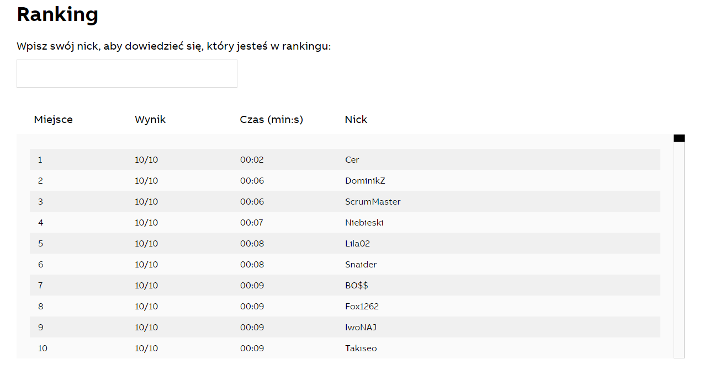

# cv-task-automation
OpenCV and PyAutoGUI based scripts for automating repetitive tasks.

## reset_wifi.py
Variant of the script I used to reset my WiFi router. It was malfunctioning and it kept going down every 20-30 minutes,
but I really needed to download something overnight, so I've decided to reuse my older code and automate this task.
The script was in use until a repairman replaced the router.

## competition.py
ABB organised [an event for students](https://backtoschoolwithabb.pl). Every contestant had to answer 10 questions 
correctly in the shortest time possible. Long story short it became a playground for bots. Due to the time constraint
the code was as imperative as possible to minimize function calls timing that gave me an additional second.

I was almost on top the ranking until they disqualified every entry below 10 seconds. 
Today I would try a Selenium/requests based approach as I believe it could yield much faster results.

## image_manipulation.py
Scrap code I've been using while working on a pixel based version of my 
[LoL AFK Buddy](https://github.com/dominik-air/lol-afk-buddy) app. 